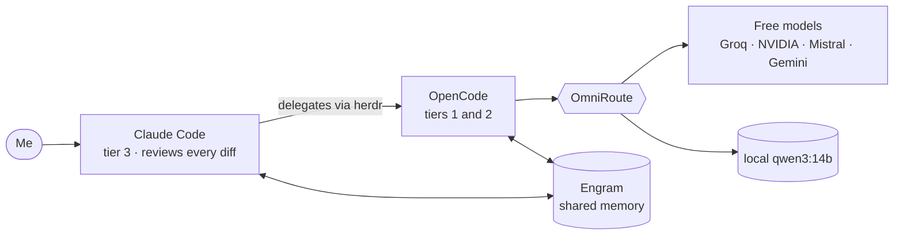

<a id="top"></a>

<div align="center">


</div>

[Español](README.md) · **English**

# elvinlab.dev

> **Full-stack engineer building with AI agents.** Portfolio and **Lab Notes** —*by an eternal junior*—: a blog that documents the decisions behind what I build, not generic tutorials.

<div align="center">

[](https://github.com/elvinlab/elvinlab.dev/actions/workflows/ci.yml)     

**[See the site](https://elvinlab.dev/en/)** · **[Lab Notes](https://elvinlab.dev/notes/)** · **[About me](https://elvinlab.dev/en/me/)** · **[Configuration guide](docs/CONFIGURATION.en.md)** · **[How to create a note](docs/NOTES.en.md)**

</div>

## What it is

It is my portfolio (`/me`) and my blog (`/notes`) in a single site, and the first project of the **elvinlab** brand. Each note tells **one concrete decision**: the problem, what I tried, what I ruled out and why, with numbers. It is built to be **fast, accessible, honest and easy to operate**, and so that someone else can adopt it by changing only configuration and content.

It is also where [`@elvinlab/core`](packages/core) is born, the design base (tokens, themes and i18n) my next projects will share.

## Screenshots

<div align="center">

<picture>
  <source media="(prefers-color-scheme: light)" srcset="docs/assets/home-light.webp">
  
</picture>

 

<sub><b>Home, a note and reading mode on mobile.</b> Everything looks the same in light and dark theme.</sub>

</div>

## Philosophy

These ideas are already decided and repeat across the code, the tests and the documents:

- **A blog of decisions, not tutorials.** Each note is one decision: context, what I chose and what came out of it, with numbers and names instead of adjectives.
- **It is born in the project, it moves to `core` when it repeats.** The shared base is not designed in advance. `core` is presentation only (tokens, themes, i18n): it never does `fetch` or stores data.
- **Measured, not promised.** Performance and accessibility budgets that **break the CI** when they are not met.
- **Accessible and respectful.** WCAG AA, 44 px touch targets, it honors `prefers-reduced-motion`, self-hosted fonts, the site sets no cookies of its own and the browser language never redirects.
- **Honest.** It only states what it can verify (privacy included), does not announce projects that do not exist, does not link private repositories and never publishes my email.
- **White-label by design.** Someone else adopts it **with configuration and content only**; the style (layout, motion, motifs) stays in the code. A test builds the site with another identity and fails if anything of mine leaks.
- **Spanish by default, English optional.** One note, one language. The interface is in both.
- **Simple to operate.** A single environment, a push to `main` is a release and the CI runs **once** before deploying.

## Built with agentic-dev-setup

This site was built with [**agentic-dev-setup**](https://github.com/elvinlab/agentic-dev-setup), my open-source (MIT) multi-agent development environment: **Claude Code thinks and reviews, cheaper models type**. Bounded work is delegated to OpenCode agents through herdr, OmniRoute routes them to free models with a local `qwen3:14b` as the last step, and Engram gives everyone a shared memory.



This is how work goes here: every task is an *issue* written as a delegation brief with a **tier** (1 trivial, 2 bounded, 3 complex); development is **strict TDD**; and a more expensive model **reviews every diff** written by a cheaper one. The full story is in the note [Claude thinks, cheap models type](https://elvinlab.dev/notes/agentic-dev-setup/) (in Spanish).

## Technologies

| Layer | Technology | What it is used for |
| --- | --- | --- |
| Framework | **Astro 7** + MDX | Prerendered pages, MDX content and islands only where needed |
| Interface | **Tailwind CSS 4**, **Preact 10**, **TypeScript 6** (strict) | Styles with semantic tokens; a single island (the contact form) |
| Content | **Content Collections** with **Zod 4**, **Expressive Code** | MDX notes and JSON validated at build time; code blocks with frames and copy |
| SEO and sharing | Sitemap, RSS, JSON-LD, **Sharp**, **Satori** | Metadata, optimized images and one share card per note |
| Typography and graphics | Space Grotesk, JetBrains Mono, Pixelify Sans, Press Start 2P (Fontsource) and custom **WebGL2** | Self-hosted fonts and animated banner backgrounds, no libraries |
| Hosting | **Cloudflare Workers** + **Wrangler** | A single environment; domain and DNS on Cloudflare |
| Services | **Turnstile**, **Resend**, **Web Analytics**, **Giscus** | Anti-bot, form email, minimal analytics and comments on GitHub Discussions |
| Quality | **Vitest 5**, **Playwright** + **axe-core**, **Lighthouse CI**, **Biome**, **dependency-cruiser** | Tests, accessibility, performance, formatting and architecture boundaries |
| Tooling | **pnpm 12** (workspaces), **mise** (Node 24), **GitHub Actions**, **Dependabot** | Monorepo, pinned versions, CI/CD and weekly updates |
| Assisted development | **agentic-dev-setup**: Claude Code, herdr, OpenCode, OmniRoute, Ollama and Engram | How it was built (previous section) |

## What it includes

- **Lab Notes**: index by year with a filter, side table of contents with progress, decision record, reading time, related notes, previous/next and RSS.
- Optional **reading mode** on every note: a single column, no animated banner or sidebar, for comfortable reading on mobile and desktop.
- **Comments and reactions** with Giscus, loaded only when you reach them.
- Own **share cards** for each note and for `/me`, generated at build time.
- **`/me`**: a portfolio with experience, certificates and experiments; it prints cleanly to PDF.
- A safe **contact form**: Turnstile, a send limit and it fails closed when configuration is missing.
- A **public changelog**, **privacy and terms pages** and a **light/dark theme** with selectable animated backgrounds.
- **Bilingual** (ES/EN) with no language redirects.

## Measured quality

The CI verifies all of this; if something fails, there is no deploy:

- **Mobile Lighthouse** ≥ 95 in performance, accessibility, best practices and SEO; LCP ≤ 2.5 s and CLS ≤ 0.1.
- **JavaScript** ≤ 30 KiB (gzip) per page.
- **Accessibility with axe** (WCAG 2 A, AA and 2.1 AA) in light and dark theme and at 360, 768 and 1280 px.
- Over **400 unit tests** and over **320 e2e** tests in a browser.
- One test checks that the site **sets no cookies of its own** and another that nothing of the owner leaks into a build with another identity.

## Getting started

You need [mise](https://mise.jdx.dev) (it installs the pinned Node and pnpm versions).

```bash
git clone https://github.com/elvinlab/elvinlab.dev.git
cd elvinlab.dev
mise install                                   # Node 24 and pnpm 12
mise exec -- pnpm install                      # dependencies
mise exec -- pnpm exec playwright install chromium   # once, for the browser tests
mise exec -- pnpm --filter web dev             # http://localhost:4321
```

The contact form needs Cloudflare secrets; without them it shows the "unavailable" state. [The configuration guide](docs/CONFIGURATION.en.md#5-reference-environment-variables-and-secrets) explains how to try it locally with the test keys.

## Commands

| Command | What it does |
| --- | --- |
| `pnpm --filter web dev` | Development server (includes note drafts) |
| `pnpm --filter web build` | Production build in `apps/web/dist` |
| `pnpm test` | Unit tests |
| `pnpm test:e2e` | Browser tests: smoke, accessibility, theme, comments, reading mode |
| `pnpm typecheck` · `pnpm lint` · `pnpm depcruise` | Types, format and lint, architecture boundaries |
| `pnpm check:js-budget` · `pnpm test:lighthouse` | JavaScript and Lighthouse budgets |
| `pnpm test:white-label` | Builds with another identity and looks for owner leaks |
| `pnpm new-post "Title"` | Creates a note draft |
| `pnpm docs:config` | Regenerates the tables in the configuration guide |

All of them run with `mise exec -- pnpm ...` to use the pinned versions.

## Repository structure

```
apps/web/        → the site (Astro): features/ by functionality, pages/, shared/ and content/
packages/core/   → @elvinlab/core: tokens, themes and i18n (presentation only)
docs/            → guides, brand, design, plan and ADRs
tests/           → e2e tests (Playwright) and isolated test notes
.github/         → CI, Dependabot and task template
odd/tasks/       → tracking of each feature
```

## Documentation

| Document | What it covers |
| --- | --- |
| [Configuration and update guide](docs/CONFIGURATION.en.md) | **Where each thing is configured and how everything is updated**: settings, content, secrets, dependencies and releases |
| [How to create a note](docs/NOTES.en.md) | Detailed step by step, from draft to production |
| [`docs/PLAN.md`](docs/PLAN.md) | Vision, scope and rules (in Spanish) |
| [`docs/BRAND.md`](docs/BRAND.md) | Narrative, voice and brand tokens (in Spanish) |
| [`docs/DESIGN.md`](docs/DESIGN.md) | Visual direction, pages and accessibility |
| [`docs/CONVENTIONS.md`](docs/CONVENTIONS.md) | Architecture, code, styling and git flow |
| [`docs/TESTING.md`](docs/TESTING.md) | Browser tests and quality budgets |
| [`docs/adr/`](docs/adr/README.md) | Architecture decisions, one per document |

## Releasing

Work happens on `develop` with free pushes. A release is a push to `main`, which triggers the CI once (`static`, `e2e` and `lighthouse` → `checks` → `deploy`) and deploys to production with a smoke check and automatic rollback. The exact steps, how to roll back and what to check afterwards are in [the configuration guide](docs/CONFIGURATION.en.md#7-releasing-and-rolling-back).

## Using it as a base

The site is meant to be adopted by someone else by replacing `site.config.ts`, the content and the images in `public/`. The full recipe and how to verify it are in [the guide](docs/CONFIGURATION.en.md#10-using-this-site-as-a-base-for-someone-else-white-label).

## Status and license

In production at [elvinlab.dev](https://elvinlab.dev) since October 1, 2026. Progress is in the [GitHub Project](https://github.com/users/elvinlab/projects/2) and the history of visible changes in the [changelog](https://elvinlab.dev/en/changelog/).

The code is released under the [MIT license](LICENSE). The notes (the content of `content/notes`) are published under [CC BY-NC-SA 4.0](https://creativecommons.org/licenses/by-nc-sa/4.0/).

## Author

**Elvin González** · Costa Rica · [elvinlab.dev](https://elvinlab.dev/en/) · [GitHub](https://github.com/elvinlab) · [LinkedIn](https://www.linkedin.com/in/elvinlab) · [X](https://x.com/elvinlabweb)

<p align="right"><a href="#top">↑ Back to top</a></p>
