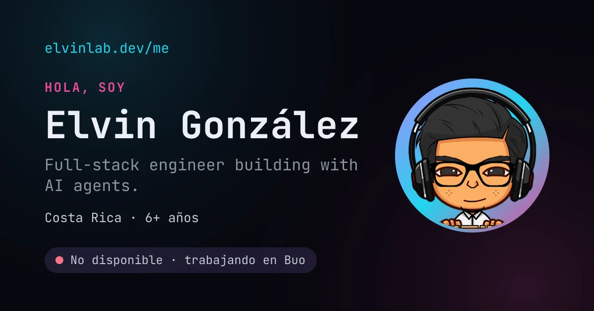
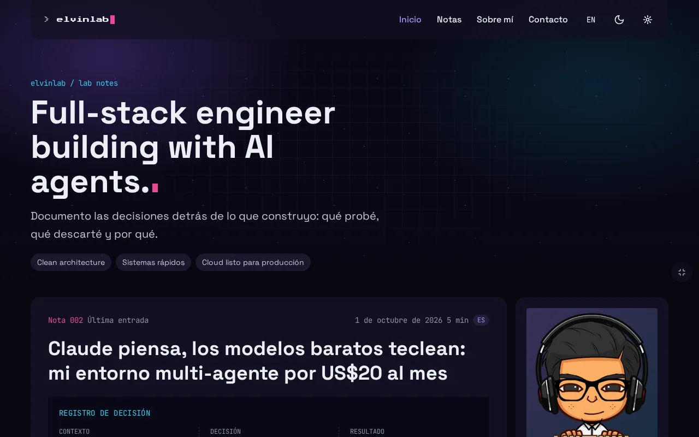
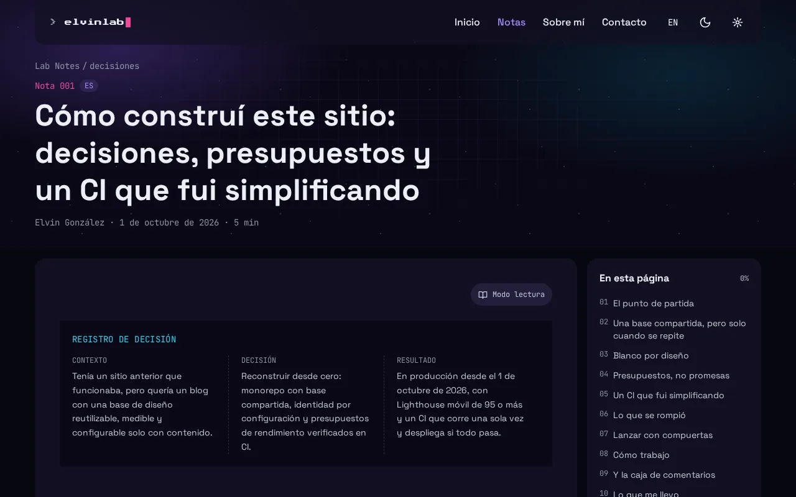
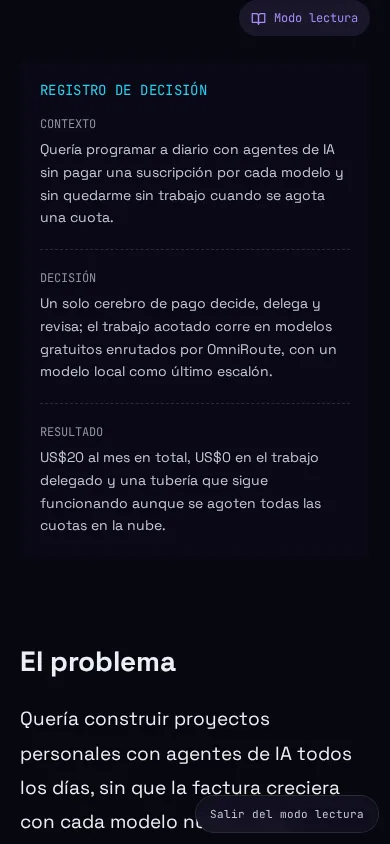
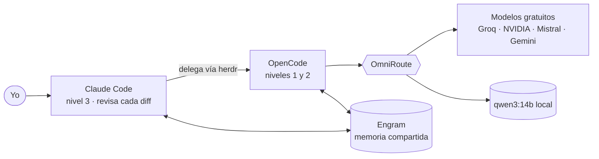

<a id="top"></a>

<div align="center">



</div>

**Español** · [English](README.en.md)

# elvinlab.dev

> **Full-stack engineer building with AI agents.** Portafolio y **Lab Notes** —*by an eternal junior*—: un blog que documenta las decisiones detrás de lo que construyo, no tutoriales genéricos.

<div align="center">

[](https://github.com/elvinlab/elvinlab.dev/actions/workflows/ci.yml)     

**[Ver el sitio](https://elvinlab.dev)** · **[Lab Notes](https://elvinlab.dev/notes/)** · **[Sobre mí](https://elvinlab.dev/me/)** · **[Guía de configuración](docs/CONFIGURATION.md)** · **[Cómo crear una nota](docs/NOTES.md)**

</div>

## Qué es

Es mi portafolio (`/me`) y mi blog (`/notes`) en un solo sitio, y el primer proyecto de la marca **elvinlab**. Cada nota cuenta **una decisión concreta**: el problema, qué probé, qué descarté y por qué, con números. Está construido para ser **rápido, accesible, honesto y fácil de operar**, y para que otra persona pueda adoptarlo cambiando solo configuración y contenido.

Además es el terreno donde nace [`@elvinlab/core`](packages/core), la base de diseño (tokens, temas e i18n) que van a compartir mis próximos proyectos.

## Capturas

<div align="center">

<picture>
  <source media="(prefers-color-scheme: light)" srcset="docs/assets/home-light.webp">
  
</picture>

 

<sub><b>Inicio, una nota y el modo lectura en móvil.</b> Todo se ve igual en tema claro y oscuro.</sub>

</div>

## Filosofía

Estas ideas ya están decididas y se repiten en el código, los tests y los documentos:

- **Un blog de decisiones, no de tutoriales.** Cada nota es una decisión: contexto, qué elegí y qué resultó, con números y nombres en lugar de adjetivos.
- **Nace en el proyecto, se mueve a `core` cuando se repite.** No se diseña la base compartida por adelantado. `core` es solo presentación (tokens, temas, i18n): nunca hace `fetch` ni guarda datos.
- **Medido, no prometido.** Presupuestos de rendimiento y accesibilidad que **rompen el CI** si no se cumplen.
- **Accesible y respetuoso.** WCAG AA, objetivos táctiles de 44 px, respeta `prefers-reduced-motion`, tipografías autoalojadas, el sitio no establece cookies propias y el idioma del navegador nunca redirige.
- **Honesto.** Solo afirma lo que puede verificar (también en privacidad), no anuncia proyectos que no existen, no enlaza repositorios privados y nunca publica mi correo.
- **White-label por diseño.** Otra persona lo adopta **solo con configuración y contenido**; el estilo (layout, movimiento, motivos) queda en el código. Un test construye el sitio con otra identidad y falla si se filtra algo mío.
- **Español por defecto, inglés opcional.** Una nota, un idioma. La interfaz está en ambos.
- **Simple de operar.** Un solo entorno, un push a `main` es un release y el CI corre **una vez** antes de desplegar.

## Construido con agentic-dev-setup

Este sitio se construyó con [**agentic-dev-setup**](https://github.com/elvinlab/agentic-dev-setup), mi entorno de desarrollo multi-agente de código abierto (MIT): **Claude Code piensa y revisa, y modelos más baratos teclean**. El trabajo acotado se delega a agentes de OpenCode a través de herdr, OmniRoute los enruta a modelos gratuitos con `qwen3:14b` local como último escalón, y Engram da memoria compartida a todos.



Así se trabaja aquí: cada tarea es un *issue* escrito como un brief de delegación con un **nivel** (1 trivial, 2 acotado, 3 complejo); el desarrollo es con **TDD estricto**; y un modelo más caro **revisa cada diff** que escribió uno más barato. La historia completa está en la nota [Claude piensa, los modelos baratos teclean](https://elvinlab.dev/notes/agentic-dev-setup/).

## Tecnologías

| Capa | Tecnología | Para qué se usa |
| --- | --- | --- |
| Framework | **Astro 7** + MDX | Páginas prerenderizadas, contenido en MDX e islas solo donde hacen falta |
| Interfaz | **Tailwind CSS 4**, **Preact 10**, **TypeScript 6** (estricto) | Estilos con tokens semánticos; una sola isla (el formulario de contacto) |
| Contenido | **Content Collections** con **Zod 4**, **Expressive Code** | Notas MDX y JSON validados al compilar; bloques de código con marcos y copiar |
| SEO y compartir | Sitemap, RSS, JSON-LD, **Sharp**, **Satori** | Metadatos, imágenes optimizadas y una tarjeta al compartir por nota |
| Tipografía y gráficos | Space Grotesk, JetBrains Mono, Pixelify Sans, Press Start 2P (Fontsource) y **WebGL2** propio | Fuentes autoalojadas y fondos animados del banner, sin librerías |
| Hosting | **Cloudflare Workers** + **Wrangler** | Un solo entorno; dominio y DNS en Cloudflare |
| Servicios | **Turnstile**, **Resend**, **Web Analytics**, **Giscus** | Anti-bot, correo del formulario, analítica mínima y comentarios en GitHub Discussions |
| Calidad | **Vitest 5**, **Playwright** + **axe-core**, **Lighthouse CI**, **Biome**, **dependency-cruiser** | Tests, accesibilidad, rendimiento, formato y fronteras de arquitectura |
| Herramientas | **pnpm 12** (workspaces), **mise** (Node 24), **GitHub Actions**, **Dependabot** | Monorepo, versiones fijas, CI/CD y actualizaciones semanales |
| Desarrollo asistido | **agentic-dev-setup**: Claude Code, herdr, OpenCode, OmniRoute, Ollama y Engram | Cómo se construyó (sección anterior) |

## Qué incluye

- **Lab Notes**: índice por año con filtro, índice lateral con progreso, registro de decisión, tiempo de lectura, notas relacionadas, anterior/siguiente y RSS.
- **Modo lectura** opcional en cada nota: una sola columna, sin banner animado ni barra lateral, para leer cómodo en móvil y escritorio.
- **Comentarios y reacciones** con Giscus, cargados solo al llegar a ellos.
- **Tarjetas al compartir** propias para cada nota y para `/me`, generadas al compilar.
- **`/me`**: portafolio con experiencia, certificados y experimentos; se imprime limpio a PDF.
- **Formulario de contacto** seguro: Turnstile, límite de envíos y falla cerrado si falta configuración.
- **Changelog público**, **páginas de privacidad y términos** y **tema claro/oscuro** con fondos animados elegibles.
- **Aspecto configurable**: el preset `appearance` (`minimal` o `full`) fija la escala tipográfica, la altura de los banners y el detalle de las notas, y `home` activa o apaga cada sección de la portada.
- **Bilingüe** (ES/EN) sin redirecciones por idioma.

## Calidad medida

Todo esto lo verifica el CI; si algo falla, no hay despliegue:

- **Lighthouse móvil** ≥ 95 en rendimiento, accesibilidad, buenas prácticas y SEO; LCP ≤ 2,5 s y CLS ≤ 0,1.
- **JavaScript** ≤ 30 KiB (gzip) por página.
- **Accesibilidad con axe** (WCAG 2 A, AA y 2.1 AA) en tema claro y oscuro y en 360, 768 y 1280 px.
- Más de **400 tests unitarios** y más de **320 e2e** en navegador.
- Un test comprueba que el sitio **no establece cookies propias** y otro que nada del dueño se filtra en una compilación con otra identidad.

## Empezar

Necesitas [mise](https://mise.jdx.dev) (instala las versiones fijas de Node y pnpm).

```bash
git clone https://github.com/elvinlab/elvinlab.dev.git
cd elvinlab.dev
mise install                                   # Node 24 y pnpm 12
mise exec -- pnpm install                      # dependencias
mise exec -- pnpm exec playwright install chromium   # una vez, para los tests de navegador
mise exec -- pnpm --filter web dev             # http://localhost:4321
```

El formulario de contacto necesita secretos de Cloudflare; sin ellos muestra el estado «no disponible». En [la guía de configuración](docs/CONFIGURATION.md#5-referencia-variables-de-entorno-y-secretos) está cómo probarlo en local con las claves de prueba.

## Comandos

| Comando | Qué hace |
| --- | --- |
| `pnpm --filter web dev` | Servidor de desarrollo (incluye los borradores de notas) |
| `pnpm --filter web build` | Compilación de producción en `apps/web/dist` |
| `pnpm test` | Tests unitarios |
| `pnpm test:e2e` | Tests de navegador: smoke, accesibilidad, tema, comentarios, modo lectura |
| `pnpm typecheck` · `pnpm lint` · `pnpm depcruise` | Tipos, formato y lint, fronteras de arquitectura |
| `pnpm check:js-budget` · `pnpm test:lighthouse` | Presupuestos de JavaScript y de Lighthouse |
| `pnpm test:white-label` | Compila con otra identidad y busca filtraciones del dueño |
| `pnpm new-post "Título"` | Crea el borrador de una nota |
| `pnpm docs:config` | Regenera las tablas de la guía de configuración |

Todos se ejecutan con `mise exec -- pnpm ...` para usar las versiones fijas.

## Estructura del repositorio

```
apps/web/        → el sitio (Astro): features/ por funcionalidad, pages/, shared/ y content/
packages/core/   → @elvinlab/core: tokens, temas e i18n (solo presentación)
docs/            → guías, marca, diseño, plan y ADRs
tests/           → tests e2e (Playwright) y notas de prueba aisladas
.github/         → CI, Dependabot y plantilla de tareas
odd/tasks/       → seguimiento de cada funcionalidad
```

## Documentación

| Documento | Qué cuenta |
| --- | --- |
| [Guía de configuración y actualización](docs/CONFIGURATION.md) | **Dónde se configura cada cosa y cómo se actualiza todo**: ajustes, contenido, secretos, dependencias y releases |
| [Cómo crear una nota](docs/NOTES.md) | Paso a paso detallado, del borrador a producción |
| [`docs/PLAN.md`](docs/PLAN.md) | Visión, alcance y reglas (en español) |
| [`docs/BRAND.md`](docs/BRAND.md) | Narrativa, voz y tokens de marca (en español) |
| [`docs/DESIGN.md`](docs/DESIGN.md) | Dirección visual, páginas y accesibilidad |
| [`docs/CONVENTIONS.md`](docs/CONVENTIONS.md) | Arquitectura, código, estilos y flujo de git |
| [`docs/TESTING.md`](docs/TESTING.md) | Tests de navegador y presupuestos de calidad |
| [`docs/adr/`](docs/adr/README.md) | Decisiones de arquitectura, una por documento |

## Publicar

Se trabaja en `develop` con push libre. El release es un push a `main`, que dispara el CI una sola vez (`static`, `e2e` y `lighthouse` → `checks` → `deploy`) y despliega a producción con una comprobación de humo y rollback automático. Los pasos exactos, cómo revertir y qué revisar después están en [la guía de configuración](docs/CONFIGURATION.md#7-publicar-release-y-revertir).

## Usarlo como base

El sitio está pensado para que otra persona lo adopte reemplazando `site.config.ts`, el contenido y las imágenes de `public/`. La receta completa y su verificación están en [la guía](docs/CONFIGURATION.md#10-usar-este-sitio-como-base-para-otra-persona-white-label).

## Estado y licencia

En producción en [elvinlab.dev](https://elvinlab.dev) desde el 1 de octubre de 2026. El avance está en el [GitHub Project](https://github.com/users/elvinlab/projects/2) y el historial de cambios visibles, en el [changelog](https://elvinlab.dev/changelog/).

El código se publica bajo la [licencia MIT](LICENSE). Las notas (el contenido de `content/notes`) se publican bajo [CC BY-NC-SA 4.0](https://creativecommons.org/licenses/by-nc-sa/4.0/deed.es).

## Autor

**Elvin González** · Costa Rica · [elvinlab.dev](https://elvinlab.dev) · [GitHub](https://github.com/elvinlab) · [LinkedIn](https://www.linkedin.com/in/elvinlab) · [X](https://x.com/elvinlabweb)

<p align="right"><a href="#top">↑ Volver arriba</a></p>
